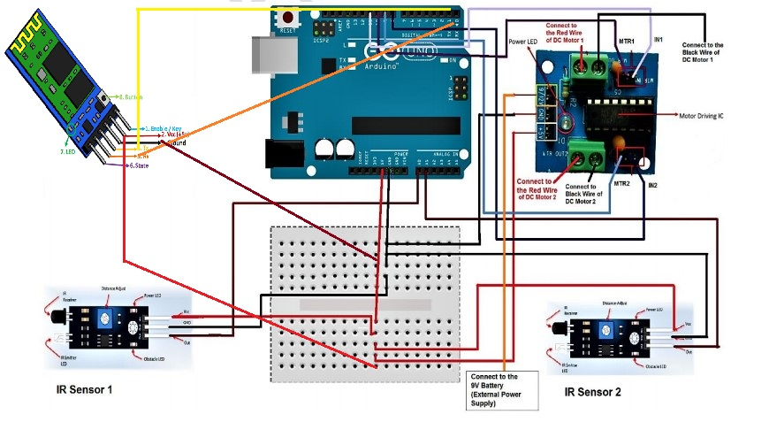
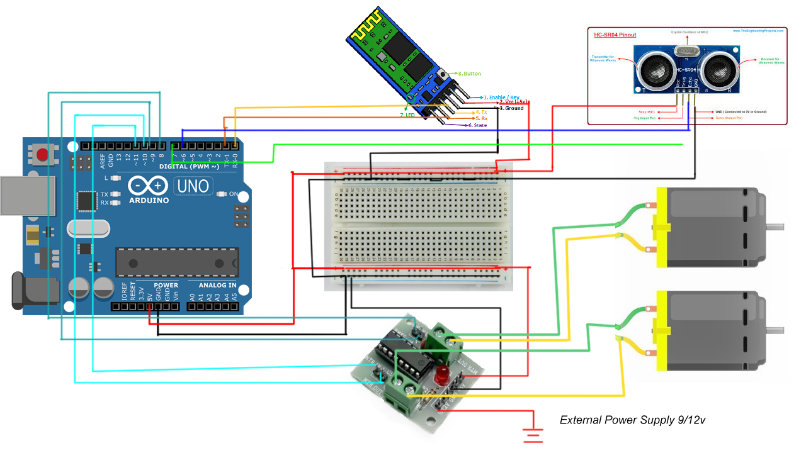

# RoBotO.1

<h3>Mobile Controlled Robot Components</h3><ul><li>Arduino Uno with cable: 1</li><li>Bluetooth HC-05:&nbsp; 1</li><li>IR Sensor:&nbsp; 2</li><li>L293D Module: 1</li><li>Jumper Wires: 20pcs</li><li>Chassis: 1</li><li>BO Motor: 2</li><li>Caster wheel: 1</li><li>Breadboard: 1</li><li>Wheels: 2</li><li>Screws set – 1</li><li>Clamps – 2</li><li>9v Battery – 2</li><li>Battery Snap – 2</li></ul>
<h3>Components:</h3>
<p align="left">
  
</p>
<h3>Circuit Diagram:</h3>
<p align="left">
  
</p>
<h3>Code:</h3>

```c++
// code away!
/*------ Arduino Code----- */ 
/*-------definning Inputs------*/ 
#define LS 2      // left sensor 
#define RS 3      // right sensor 
 
/*-------definning Outputs------*/ 
#define LM1 4       // left motor 
#define LM2 5       // left motor 
#define RM1 6       // right motor 
#define RM2 7       // right motor
void setup () { 
    pinMode(LS, INPUT);
    pinMode(RS, INPUT);   
    pinMode(LM1, OUTPUT);   
    pinMode(LM2, OUTPUT);   
    pinMode(RM1, OUTPUT);   
    pinMode(RM2, OUTPUT);
} 
void loop() { 
  if(digitalRead(LS) && digitalRead(RS))     // Move Forward 
  { 
    digitalWrite(LM1, HIGH);     
    digitalWrite(LM2, LOW);     
    digitalWrite(RM1, HIGH);     
    digitalWrite(RM2, LOW); 
  } 
   
  if(!(digitalRead(LS)) && digitalRead(RS))     // Turn right 
  { 
    digitalWrite(LM1, LOW);     
    digitalWrite(LM2, LOW);     
    digitalWrite(RM1, HIGH);     
    digitalWrite(RM2, LOW); 
  } 
   
  if(digitalRead(LS) && !(digitalRead(RS)))     // turn left 
  { 
    digitalWrite(LM1, HIGH);     
    digitalWrite(LM2, LOW);     
    digitalWrite(RM1, LOW);     
    digitalWrite(RM2, LOW); 
  } 
   
  if(!(digitalRead(LS)) && !(digitalRead(RS)))     // stop 
  { 
    digitalWrite(LM1, LOW);     
    digitalWrite(LM2, LOW);     
    digitalWrite(RM1, LOW);     
    digitalWrite(RM2, LOW); 
  } 
} 
```
# RoBotO.2

<h3>Mobile Controlled & Obstacle Avoidance using Ultrsonic - Robot Components</h3><ul><li>Arduino Uno with cable: 1</li><li><b>Ultrasonic Module:&nbsp; 1</b></li><li>Bluetooth HC-05:&nbsp; 1</li><li>IR Sensor:&nbsp; 2</li><li>L293D Module: 1</li><li>Jumper Wires: 20pcs</li><li>Chassis: 1</li><li>BO Motor: 2</li><li>Caster wheel: 1</li><li>Breadboard: 1</li><li>Wheels: 2</li><li>Screws set – 1</li><li>Clamps – 2</li><li>9v Battery – 2</li><li>Battery Snap – 2</li></ul>

<h3>Circuit Diagram:</h3>
<p align="left">
  
</p>
<h3>Code:</h3>

```c++
// code away!
#include <Servo.h>
#define LS 12      // left sensor 
#define RS 13      // right sensor 
#define L1 10       // left motor 
#define L2 11       // left motor 
#define R1 8       // right motor 
#define R2 9       // right motor 
#define E 2 // attach pin D2 Arduino to pin Echo of HC-SR04
#define T 3 //attach pin D3 Arduino to pin Trig of HC-SR04
#define S 5 // for speed of pin 5
#define SR 4// Servo
Servo srv;  // create servo object to control a servo

void setup ()
{
  Serial.begin(9600);
  pinMode(LS, INPUT);
  pinMode(RS, INPUT);
  pinMode(L1, OUTPUT);
  pinMode(L2, OUTPUT);
  pinMode(R1, OUTPUT);
  pinMode(R2, OUTPUT);
  pinMode(S, OUTPUT);
  pinMode(T, OUTPUT);
  pinMode(E, INPUT);
  srv.attach(SR);

}


unsigned int s = 255;
void loop()
{
  String str = "";
  char c;
  int di = ping(); // Ping for ultrasonic distance measure

  if (Serial.available()) {
    while (Serial.available()) {

      str = str + (char)Serial.read(); // Read bluetooth data

    }
    if (str.length() > 0) {
      c = str[0];
    }

    if (c == '1') {
      move(true, false, true, false, s); // Forward
    } else if (c == '2') {
      move(false, true, false, true, s); // Backward
    } else if (c == '3') {
      move(true, false, false, true, s);// Left
    } else if (c == '4') {
      move(false, true, true, false, s); // Right
    } else if (c == '5') {
      move(false, false, false, false, s); // Stop
    } else if (str.startsWith("s:")) {
      s = str.substring(2).toInt(); // Speed
    } else if (str.startsWith("z:")) {
      srv.write(str.substring(2).toInt()); // Servo
    } else if (str.startsWith("t:")) {
      tone(6, 480, str.substring(2).toInt()); // Horn
    }

  }
  if ((di < 20 || !digitalRead(LS) || !digitalRead(RS)) && c != '2') {
    move(false, false, false, false, s); // Stop
  }
}
int ping() {
  delay(100);

  // Clears the trigPin condition
  digitalWrite(T, LOW);
  delayMicroseconds(2);
  // Sets the trigPin HIGH (ACTIVE) for 10 microseconds
  digitalWrite(T, HIGH);
  delayMicroseconds(10);
  digitalWrite(T, LOW);
  // Reads the echoPin, returns the sound wave travel time in microseconds
  int du = pulseIn(E, HIGH);
  // Calculating the distance
  return du * 0.034 / 2; // Speed of sound wave divided by 2 (go and back)
}
void move(bool l1, bool l2, bool r1, bool r2, int s) {
  analogWrite(S, s);
  digitalWrite(L1, l1);
  digitalWrite(L2, l2);
  digitalWrite(R1, r1);
  digitalWrite(R2, r2);

}
```

# RoBotO.3

<h3>Automatic Obstacle Avoidance using Ultrsonic - Robot Components</h3><ul><li>Arduino Uno with cable: 1</li><li>Ultrasonic Module:&nbsp; 1</li><li><b>Servo 9G:&nbsp; 1</b></li><li>Bluetooth HC-05:&nbsp; 1</li><li>IR Sensor:&nbsp; 2</li><li>L293D Module: 1</li><li>Jumper Wires: 20pcs</li><li>Chassis: 1</li><li>BO Motor: 2</li><li>Caster wheel: 1</li><li>Breadboard: 1</li><li>Wheels: 2</li><li>Screws set – 1</li><li>Clamps – 2</li><li>9v Battery – 2</li><li>Battery Snap – 2</li></ul>

<h3>Circuit Diagram:</h3>
<p align="left">
  
</p>
<h3>Code:</h3>

```c++
// code away!
#include <Servo.h>
#define BS 12      // back sensor 
#define FS 13      // front sensor 
#define L1 10       // left motor 
#define L2 11       // left motor 
#define R1 8       // right motor 
#define R2 9       // right motor 
#define E 2 // attach pin D2 Arduino to pin Echo of HC-SR04
#define T 3 //attach pin D3 Arduino to pin Trig of HC-SR04
#define S 5 // for speed of pin 5
#define SR 4// Servo
#define VIN A0
Servo srv;  // create servo object to control a servo
boolean isAuto = false;// Manual Default


void setup ()
{
  Serial.begin(9600);
  pinMode(FS, INPUT);
  pinMode(BS, INPUT);
  pinMode(L1, OUTPUT);
  pinMode(L2, OUTPUT);
  pinMode(R1, OUTPUT);
  pinMode(R2, OUTPUT);
  pinMode(S, OUTPUT);
  pinMode(T, OUTPUT);
  pinMode(E, INPUT);
  pinMode(VIN, INPUT);

  srv.attach(SR);
  melody();

}
const unsigned short melodyArr[] = {
  262, 196, 196, 220, 196, 0, 247, 262
};
const byte noteDurations[] = {
  250, 125, 125, 250, 250, 250, 250, 250
};
void melody() {
  for (int i = 0; i < 8; i++) {
    int noteDuration =  noteDurations[i];
    tone(6, melodyArr[i], noteDuration);
    int pauseBetweenNotes = noteDuration * 1.30;
    delay(pauseBetweenNotes);
    noTone(6);
  }
}
unsigned int s = 255;
void loop()
{
  String str = "";
  char c;
  int di = ping();


  if (Serial.available()) {
    while (Serial.available()) {

      str = str + (char)Serial.read();

    }
    if (str.length() > 0) {
      c = str[0];
    }

    if (c == '1' && str.length() == 1) {
      move(true, false, true, false, s);
    } else if (c == '2' && str.length() == 1) {
      move(false, true, false, true, s);
    } else if (c == '3' && str.length() == 1) {
      move(true, false, false, true, s);// Left
    } else if (c == '4' && str.length() == 1) {
      move(false, true, true, false, s); // Right
    } else if (c == '5' && str.length() == 1) {
      move(false, false, false, false, s);
    } else if (str.startsWith("sp:")) {
      s = str.substring(3).toInt();
    } else if (str.startsWith("sr:")) {
      srv.write(str.substring(3).toInt());
    } else if (str.startsWith("tn:")) {
      tone(6, 480, str.substring(3).toInt());
    } else if (str.startsWith("mo:")) {
      isAuto = str.substring(3).toInt() == 0 ? false : true;
    } else if (str == "ml") {
      melody();
    } else if (str == "di") {
      Serial.println("di:" + String(di));
    } else if (str == "vin") {
      float vin = (analogRead(VIN) * 5.0) / 1023;
      Serial.println("vin:" + String(vin));
    }

  }
  char x = digitalRead(FS) ? '2' : '1';
  if ((di <= 20 || digitalRead(BS) || digitalRead(FS)) && c != x && !isAuto) {
    move(false, false, false, false, s);
  } else if (isAuto && (di <= 20 || digitalRead(FS))) {
    move(false, false, false, false, s);//Stop
    tone(6, 480, 1000);
    delay(1000);
    tone(6, 480, 1000);
    noTone(6);
    if ( ping() > 20 && !digitalRead(FS)) {
      delay(100);
      move(true, false, true, false, s);
    } else {
      delay(100);
      move(false, true, false, true, s);//Back
      delay(400);
      move(false, false, false, false, s);//Stop
      delay(300);
      int dRight = lookRight();
      delay(300);
      int dLeft = lookLeft();
      delay(300);
      if (dRight >= 20) {
        move(false, true, true, false, s); // Right
        delay(600);
        move(false, false, false, false, s);
      } else if (dLeft >= 20) {
        move(true, false, false, true, s);// Left
        delay(600);
        move(false, false, false, false, s);
      } else {
        move(false, false, false, false, s);//Stop
        melody();
      }

    }

  } else if (isAuto) {
    move(true, false, true, false, s);
  }
}
int lookRight() {
  srv.write(0);
  delay(300);
  int d = ping();
  srv.write(90);
  return d;
}
int lookLeft() {
  srv.write(180);
  delay(300);
  int d = ping();
  srv.write(90);
  return d;
}
int ping() {
  delay(100);

  // Clears the trigPin condition
  digitalWrite(T, LOW);
  delayMicroseconds(2);
  // Sets the trigPin HIGH (ACTIVE) for 10 microseconds
  digitalWrite(T, HIGH);
  delayMicroseconds(10);
  digitalWrite(T, LOW);
  // Reads the echoPin, returns the sound wave travel time in microseconds
  int du = pulseIn(E, HIGH);
  // Calculating the distance
  return du * 0.034 / 2; // Speed of sound wave divided by 2 (go and back)
}
void move(bool l1, bool l2, bool r1, bool r2, int s) {

  analogWrite(S, s);
  digitalWrite(L1, l1);
  digitalWrite(L2, l2);
  digitalWrite(R1, r1);
  digitalWrite(R2, r2);


}
```

# RoBotO App Link
  https://forms.gle/EynUE2hBy5RB1UhB8
